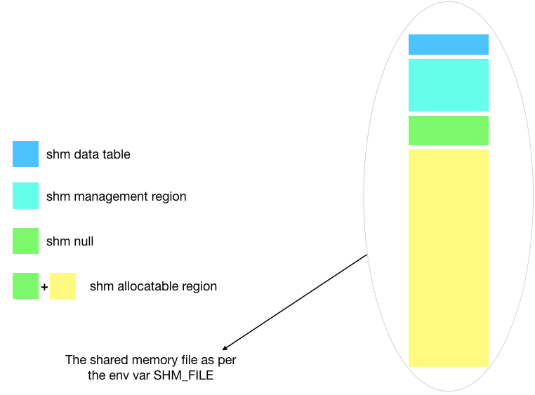

<h1>Complete Explanation</h1>

   
To start with, consider a file. The file's size is obtained by a <code>get_shm_mapping_size()</code> defined in
<code>shm_constants.c</code>. The file contains 4 regions just as shown in the image above.

<ul>
	<li>
		<a href="https://github.com/MihirLuthra/shm_alloc/blob/master/docs/source_code_explanation.md#shm-allocatable-region">
			Shm Allocatable Region
		</a>
	</li>
	<li>
		<a href="https://github.com/MihirLuthra/shm_alloc/blob/master/docs/source_code_explanation.md#shm-management-region">
			Shm Management Region
		</a>
	</li>
	<li>
		<a href="https://github.com/MihirLuthra/shm_alloc/blob/master/docs/source_code_explanation.md#shm-null">
			Shm Null
		</a>
	</li>
	<li>
		<a href="https://github.com/MihirLuthra/shm_alloc/blob/master/docs/source_code_explanation.md#shm-data-table">
			Shm Data Table
		</a>
	</li>
</ul>

<h2>Shm Allocatable Region</h2>
In the file, the area that is for actual data storage is called the <em>shm allocatable region</em>. Its size is
defined by the macro <code>MAX_ALLOCATABLE_SHM_SIZE</code>. By default it is 256 MB. This region is thought as a collection
of blocks of size <code>MAX_ALLOCATABLE_SIZE</code>. By default it is 4096 bytes. So there are 65536 blocks in the allocatable
region by default.

<h2>Shm Management Region</h2>
For every block in allocatable region, there exists a management block in <em>shm management region</em>. These management
blocks contain a bitmap and a variable that counts the memory used in that block. The management block is a variable of
type <code>struct shm_block_mgmt</code> which is defined as follows:

<pre>
struct shm_block_mgmt {
    _Atomic(shm_bitmap) mgmt_bmp[BMP_ARR_SIZE];
    _Atomic(size_t)     mem_used;
};
</pre>

<h4>mgmt_bmp</h4>
<ol>
	<li>
	Bits in <code>mgmt_bmp</code> manage memory allocation in the corresponding block in allocatable region. 
	Using default values of max/min allocatable size, bitmap would look like:
<pre>
0 --> unused bit
0 --> 4096 
00 --> 2048 
0000 --> 1024 
00000000 --> 512 
0000000000000000 --> 256 
00000000000000000000000000000000 --> 128 
0000000000000000000000000000000000000000000000000000000000000000 --> 64 
00000000000000000000000000000000000000000000000000000000000000000000000000000000000000000000000000000000000000000000000000000000 --> 32 
</pre>
	</li>
	<li>
		This bitmap is used as the <a href="https://en.wikipedia.org/wiki/Buddy_memory_allocation">buddy system</a>.
	</li>
	<li>
		Here <code>mgmt_bmp</code> has 256 bits although only 255 bits are needed. Number of bits are defined in <code>BITMAP_SIZE</code>
		This bitmap is achieved by an array of type <code>shm_bitmap</code> where array size is defined with <code>BMP_ARR_SIZE</code>.
		<code>shm_bitmap</code> is <code>uint64_t</code> if <a href="https://gcc.gnu.org/onlinedocs/cpp/Common-Predefined-Macros.html">
		<code>__LP64__</code></a> is set else it is <code>uint32_t</code>. 
	</li>
	<li>
		To allocate memory in the block, the corresponding bit needs to be set in this bitmap. 
		For example, if a bit in memory level 512 is set, none of its parent or children level may have any bit set coming directly
		above or below it respectively. 
	</li>
	<li>
		To free the memory, only that particular bit needs to be unset.
	</li>
</ol>

<h4>mem_used</h4>
	<code>mem_used</code> holds the amount of memory used in block. This variable is only for optimising the code. If the 
	<code>memory needed + mem_used > max allocatable size</code>, then we skip this block.

<h2>Shm Null</h2>

This is a part of <em>shm allocatable region</em> and is located in the start of it i.e. offset is 0. Its size is obtained by 
<a href="https://www.freebsd.org/cgi/man.cgi?sektion=3&query=getpagesize"><code>getpagesize(3)</code></a>. When mapping
the file into the process, this region is made readonly. Management blocks for shm null exists as well, as it is a part of
allocatable region. They are changed to mark shm null blocks as allocated while initialising shared memory.

<h2>Shm Data Table</h2>

This is placed at the very starting of mapping(which doesn't really make a difference). Its purpose is to make memory
search faster. It is accessed by a variable of type <code>struct shm_data_table</code> which is defined as follows:

<pre>
struct shm_data_table {
    _Atomic(shm_offt) start_blk_mgr_offt;
};
</pre>

<h4>start_blk_mgr_offt</h4>
	For a fresh shared memory i.e. all memory is unused, It stores offset to the first management block that is not full.
	Just think for once that no memory is being freed and blocks keep getting filled one by one. To allocate memory
	when n blocks are full, it would take n iterations to reach n+1th. So to avoid that, whenever a block
	gets full, this stores the offset to the next block. When next request for memory comes, search starts from
	the management block at offset <code>start_blk_mgr_offt</code>. Although, as memory keeps getting allocated,
	<code>start_blk_mgr_offt</code> eventually points to the last management block which is full as well.
	So if memory is not found in the scan from <code>start_blk_mgr_offt</code> to the end, second scan is from
	start of the management area upto <code>start_blk_mgr_offt</code> to search for memory, if any was freed by
	<code>shm_free()</code>. 
	To optimize the second scan, we need to implement a freelist as well(#TODO).
	
